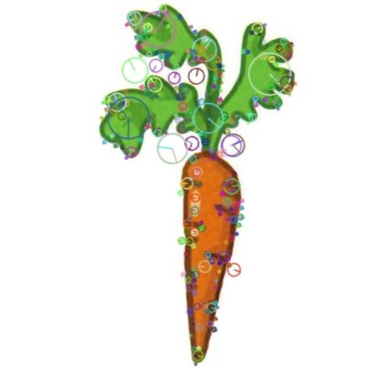
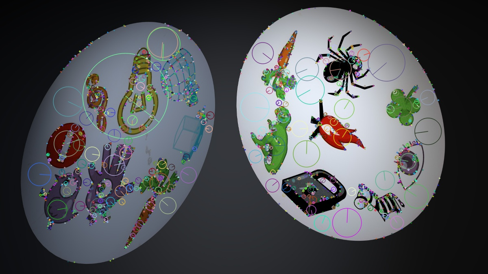

# DobbleBot
image-matching Dobble Card Symbols.

One fine day it might work on a real-time camera feed and win against people like DeepBlue and AlphaGo did. 

## Dataset
You can download all the reference images from this [kaggle competition](https://www.kaggle.com/grouby/dobble-card-images)
, or scan them on your own.

### * WORK-IN-PROGRESS *
...
#### What it does until now:
``01_circles.py`` is used to digitize the dobble cards if you decide to create your own dataset. It utilizes *hough circles* (Tutorial [here](https://www.pyimagesearch.com/2014/07/21/detecting-circles-images-using-opencv-hough-circles/), somewhat explained [here](https://www.geeksforgeeks.org/circle-detection-using-opencv-python/)) by splitting the circles out of Scanner Images (I used DIN-A4 @ 600dpi).
 For further reading, this would be an alternative to [find Circles by their shape](https://www.geeksforgeeks.org/find-circles-and-ellipses-in-an-image-using-opencv-python/) instead using Hough.

``02_symbols.py`` is used to crop the actual symbols out of the circles.
 I used functions for [finding blobs](https://learnopencv.com/blob-detection-using-opencv-python-c/), 
then [finding contours](https://pythonexamples.org/python-opencv-cv2-find-contours-in-image/) 
(e.g.[depending on brightness](https://www.pyimagesearch.com/2016/10/31/detecting-multiple-bright-spots-in-an-image-with-python-and-opencv/)),
then [get the bounding box](https://docs.opencv.org/3.4.15/da/d0c/tutorial_bounding_rects_circles.html) to crop the image down.

``03_featurematching.py`` extracts SIFT features of all 64 template images (once) and stores them as pickle-files for later use. 

It then extracts features of the (live) image 

and identifies symbols by matching features (and even computes the homography matrix -> perspective displayed as blue square). 

### what it does not (yet):
* keep a list of which symbols you have on your own card
* iterate over the "foreign" card and try to match all symbols that your card has, identifying the matching symbol (there can only be 1).

### what would be stupid and fantastic at the same time:
* calculate 3D translation matrix from homography and camera intrinsics for each symbol.
* calculate normal vectors from translation matrix. Coplanar symbols are on the same card.
* abuse code to make something Augmented-Reality-ish out of it.
* optimize image matching with deep learning instead of SIFT feature matching.
